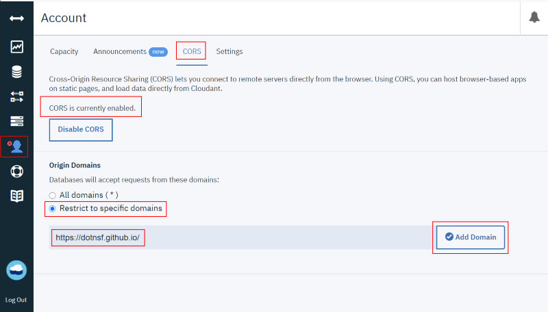

# Cloudant CORS

## Overview

CORS application sample for Cloudant.

## How to enable CORS in your IBM Cloudant

- In your Cloudant dashboard, select `Account` in your left menu.

- In `CORS` tab, make sure that your `CORS` are enabled.

- Now you can select `Restrict to specific domains`, and specify your domain.

  - If you use **Github Pages**, you should specify `https://(your-username).github.io/` here.

## How to import prefs.json into IBM Cloudant

- Create db, `mydb` for example, in your Cloudant.

- Use bulk-insert API in curl to import `prefs.json`.

  - `$ curl -u "username:password" -XPOST "https://xxxxx-bluemix.cloudantnosqldb.appdomain.cloud/mydb/_bulk_docs" -H "Content-Type: application/json" -d @prefs.json`

## How to push View, List, and Show Design Document for "all" view

- `$ curl -u "username:password" -XPUT "https://xxxxx-bluemix.cloudantnosqldb.appdomain.cloud/mydb/_design/all" -H "Content-Type: application/json" -d @all_view.json`

## How to access List Design Document for "all" view

- `https://xxxxx-bluemix.cloudantnosqldb.appdomain.cloud/mydb/_design/all/_list/all/all`

## Licensing

This code is licensed under MIT.

## Copyright

2021 K.Kimura @ Juge.Me all rights reserved.
